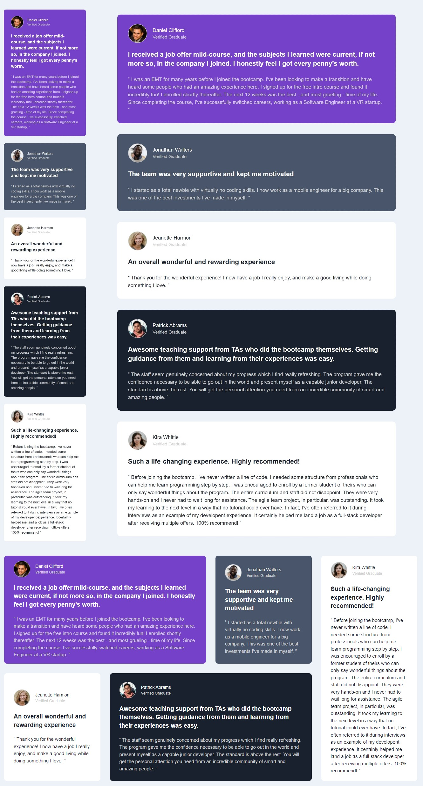

# Testimonials grid section

This is a solution to the [Testimonials grid section challenge on Frontend Mentor](https://www.frontendmentor.io/challenges/testimonials-grid-section-Nnw6J7Un7)

## The challenge

Users should be able to:

- View the optimal layout for the site depending on their device's screen size

## Links

- [Solution URL](https://www.frontendmentor.io/challenges/testimonials-grid-section-Nnw6J7Un7)
- [Live Site URL](https://jhon-okayda-testimonials-grid-section.netlify.app/)

## Built with

- Semantic HTML5 markup
- Flexbox
- CSS Grid
- Mobile-first workflow
- ReactJS Library
- Styled Components

## Author

- Created by - okayda-jhon
